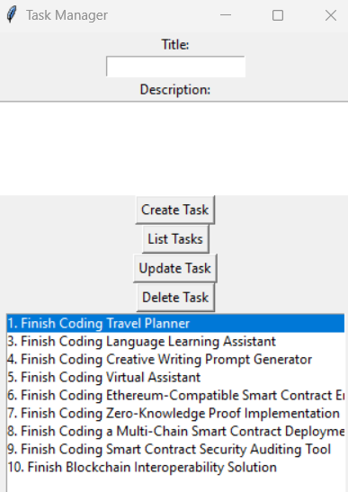

# Task Manager



Task Manager is a simple Python application with a graphical user interface (GUI) that allows users to create, list, update, and delete tasks. It provides a convenient way to manage your to-do list.

## Features

- Create new tasks with titles and descriptions.
- List all tasks to view your to-do list.
- Update existing tasks with new descriptions.
- Delete tasks you no longer need.

## Project Structure

- `task_manager_app/`: The main project directory.
    - `task_manager.py`: The main script to run the application.
    - `database.py`: Script for setting up the SQLite database.
    - `ui.py`: Script for creating the graphical user interface (GUI).
    - `task_manager.db`: SQLite database file for storing tasks.
    - `README.md`: This README file.
    
## Usage

1. Make sure you have Python installed on your computer.

2. Set up the project directory with the provided file structure.

3. Open a terminal or command prompt and navigate to the project directory.

4. Run the Task Manager application by executing the following command:

    ```
    python task_manager.py
    ```

5. The GUI for the Task Manager application will open.

6. Use the GUI to:
   - Create new tasks by entering titles and descriptions.
   - List all tasks to view your to-do list.
   - Update tasks by selecting them and providing new descriptions.
   - Delete tasks by selecting them and clicking the "Delete Task" button.

## Dependencies

- Python: The programming language used to build the application.
- tkinter: The library used for creating the GUI.
- SQLite: A lightweight database for storing task data.

## Contribution

Contributions to this project are welcome. If you have any improvements or bug fixes, feel free to submit issues or pull requests.

## License

This project is open-source and available under the [MIT License](LICENSE).
